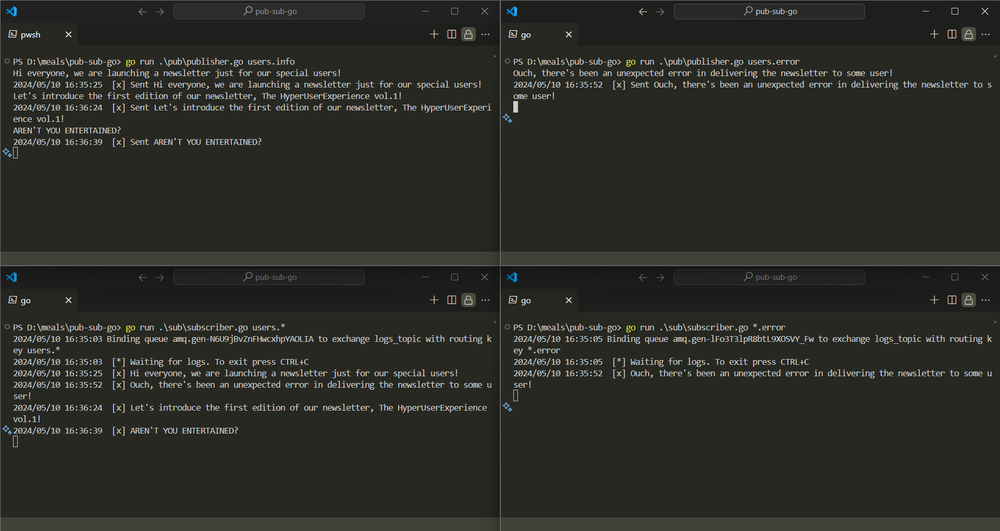

# RabbitMQ Pub/Sub

This project demonstrates a simple publisher-subscriber system using RabbitMQ and Go.

## Requirements

- Go 1.17+ (<https://go.dev/doc/install>)
- Docker (<https://www.docker.com/>)
- RabbitMQ Server (included in Docker image)

## Setup

### 1. Run RabbitMQ in Docker

```bash
docker run -it --rm --name rabbitmq -p 5672:5672 -p 15672:15672 rabbitmq:3.9-management
```

This command starts a RabbitMQ container named `rabbitmq` and exposes ports 5672 and 15672 for communication and management.

### 2. Build the Go project

```bash
cd pub-sub
go build pub
go build sub
```

This builds the publisher (pub/publisher.go) and subscriber (sub/subscriber.go) executables.

## Running the app

### Publisher

```bash
./pub.exe [severity] [message]
```

- severity (optional): Sets the severity level in the message routing key (e.g., `warning`, `error`). Defaults to "anonymous.info".
- message: The message content to be published.

### Subscriber

```bash
./sub.exe [binding_key]
```

- binding_key (multiple): Specifies routing keys to subscribe to (e.g., `*.warning`, `error.#`). You can define multiple binding keys.

### Example

#### 1. Start the publisher in a separate terminal, sending a message with severity "users.info"

```bash
.\pub.exe users.info
```

#### 2. Start the subscriber in another terminal, subscribing to messages with severity "users.*"

```bash
.\sub.exe users.*
```

### Demo Example



## Future Work

- [ ] Enhance error handling for connection failures and invalid routing keys.
- [ ] Allow configuration of connection details and exchange/queue names (environment variables or config file).
- [ ] Implement authentication and authorization for secure message exchange.
- [ ] Integrate monitoring tools to track message throughput, queue length, and errors.
